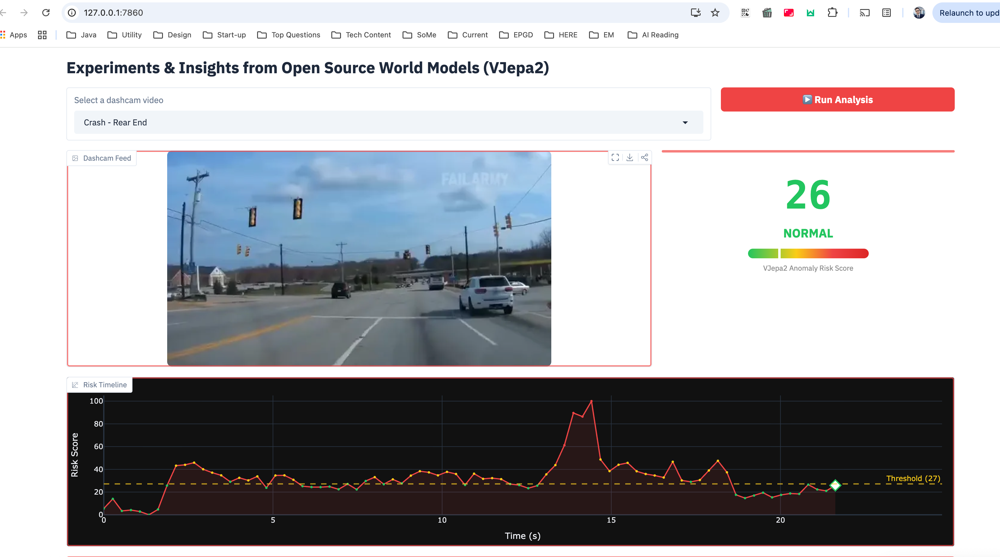
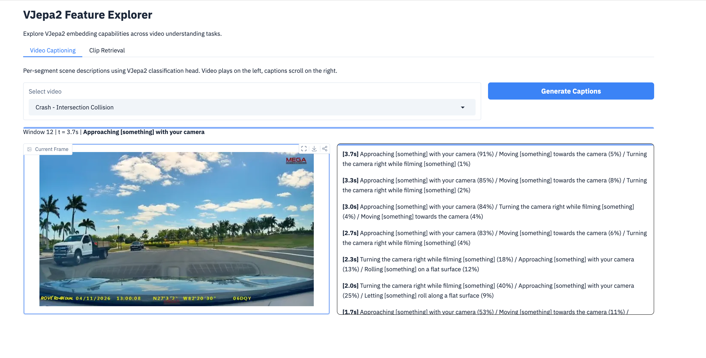

# DashCam Incident Detection Using World Models

Watch The Demo Video Here - https://youtu.be/C0gvs0kPV_Y?si=hJZWyjdOdQZeJA5n





Zero-shot incident detection in dashcam footage using VJepa2.0 as the backbone encoder.

## Scripts

| Script | Description                                                       |
|---|-------------------------------------------------------------------|
| `run_vjepa2.py` | Basic VJepa2 inference on a sample video                          |
| `run_vjepa2_live.py` | Live webcam action recognition with VJepa2                        |
| `poc_incident_detection.py` | Dashcam incident detection with risk timeline                     |
| `vjepa2_feature_explorer.py` | **VJEPA2 Feature Explorer** — video captioning and clip retrieval |

## Setup

### 1. Create environment

```bash
conda create -n vjepa2 python=3.11 -y
conda activate vjepa2
```

### 2. Install dependencies

```bash
pip install -r requirements.txt
```

> **Note:** `transformers` is installed from git because VJepa2 model support is not yet in a stable release.

### 3. SSL certificate fix (corporate networks / Zscaler)

If you get `SSL: CERTIFICATE_VERIFY_FAILED` errors, append your system certificates to the conda SSL bundle:

```bash
# macOS
security find-certificate -a -p /Library/Keychains/System.keychain > /tmp/sys_certs.pem
security find-certificate -a -p /System/Library/Keychains/SystemRootCertificates.keychain >> /tmp/sys_certs.pem
cat /tmp/sys_certs.pem >> $(python -c "import ssl; print(ssl.get_default_verify_paths().openssl_cafile)")
cat /tmp/sys_certs.pem >> $(python -c "import certifi; print(certifi.where())")
```

## Running the Demos

### Feature Explorer

```bash
conda activate vjepa2
python vjepa2_feature_explorer.py
```

Opens a Gradio UI with 2 tabs:
- **Video Captioning** — per-segment scene descriptions using VJepa2's classification head (video on left, captions on right)
- **Clip Retrieval** — find similar moments across all sample videos via cosine similarity

### POC Demo

```bash
conda activate vjepa2
python poc_incident_detection.py
```

Opens a Gradio UI at `http://localhost:7860`. Select a sample dashcam video and click **Run Analysis**.

The demo plays the video frame-by-frame with a live risk gauge and timeline that shows when VJepa2 detects anomalous events.

### Pre-computing embeddings cache

Sample videos ship with a precomputed cache (`sample_videos/precomputed_cache.pt`) so the demo runs instantly. If you add new videos to `sample_videos/`, delete the cache and the demo will recompute on first run (takes ~1-2 min per video on MPS, faster on CUDA).

## Platform Support

| Platform | Device | Status |
|---|---|---|
| macOS Apple Silicon | MPS | Tested, ~1.2s per window |
| macOS Intel | CPU | Works, ~2-3s per window |
| Linux + NVIDIA GPU | CUDA | Works, fastest (~0.3s per window) |
| Windows + NVIDIA GPU | CUDA | Should work (untested) |

The scripts auto-detect the best available device (`cuda` > `mps` > `cpu`).

## How It Works

1. A sliding 16-frame window moves across the video
2. Each window is fed through **VJepa2 ViT-L** encoder → attention pooler → 1024-d embedding
3. The first few seconds establish a "normal driving" baseline embedding
4. Each subsequent window is scored by cosine distance from the baseline
5. Windows exceeding a dynamic threshold are flagged as incidents

This is a **zero-shot approach** — VJepa2 was never trained on crash data. Its learned world model naturally produces different embeddings for unusual vs. normal motion.
